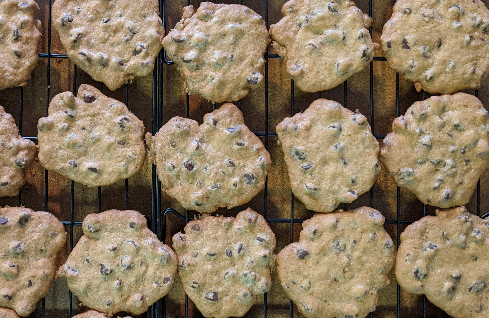
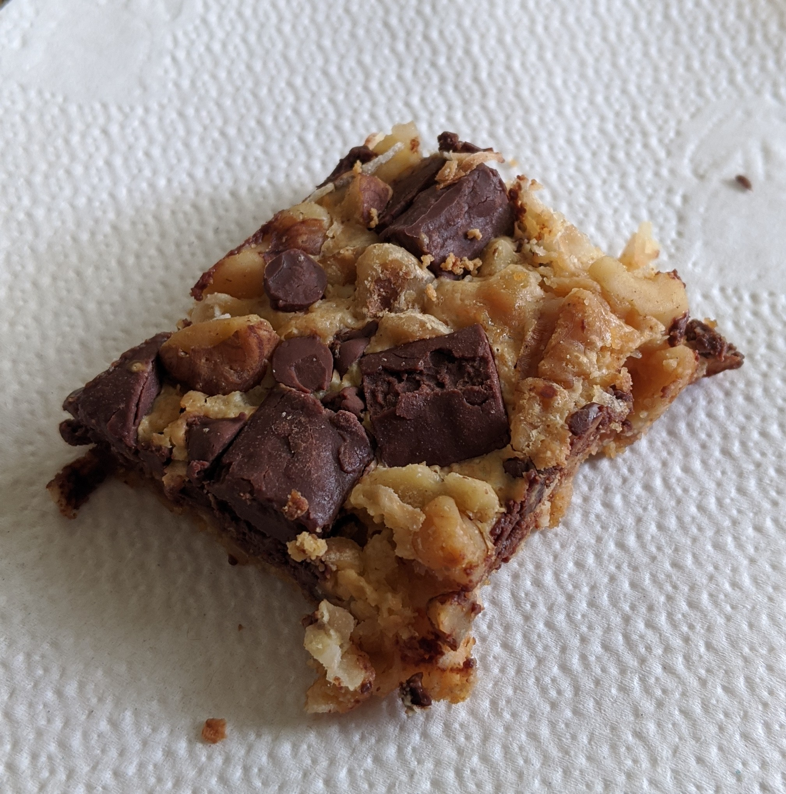
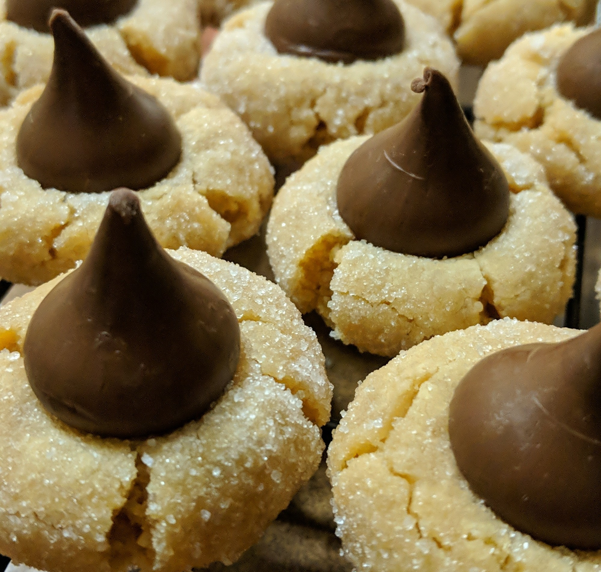

# Tate's Chocolate Chip Cookies, yield = 54

Preheat the oven to 350 degrees. Grease two cookie sheets or line them with Silpat. 

In a large bowl, stir together the flour, baking soda, and salt. 

In another large bowl, cream the butter and sugars. Add the water and vanilla. Mix the ingredients until they are just combined. Add the eggs and mix them lightly; Stir in the flour mixture. Fold in the chocolate chips. Don’t overmix the dough. 

Drop the cookies 2 inches apart onto the prepared cookie sheets using two tablespoons or an ice cream scoop. Flatten out cookie.

Bake them for 12 minutes or until the edges and centers are brown. Remove the cookies to a wire rack to cool.

|   quantity | unit     | ingredient                | notes                                   |
|-----------:|:---------|:--------------------------|:----------------------------------------|
|       2    | cup      | all-purpose flour         |                                         |
|       1    | teaspoon | baking soda               |                                         |
|       1    | teaspoon | salt                      |                                         |
|       1    | cup      | salted butter             |                                         |
|       0.75 | cup      | sugar                     |                                         |
|       0.75 | cup      | dark brown sugar          | firmly packed                           |
|       3    | teaspoon | water                     | Nonnie puts 3 tsp water (recipe only 1) |
|       1    | teaspoon | vanilla                   |                                         |
|       2    | unit     | egg                       | large                                   |
|       2    | cup      | semisweet chocolate chips |                                         |

# Magic Cookie Bars, yield = 36

Preheat oven to 350° F. In 13x9 inch baking pan, melt margarine in oven. 

Sprinkle crumbs over margarine; pour eagle brand evenly over crumbs. 

Top with remaining ingredients; press down firmly. Bake 25 to 30 minutes or until lightly browned. 

Cool. Chill throughly if desired. Cut into bars.

|   quantity | unit   | ingredient                | notes                                 |
|-----------:|:-------|:--------------------------|:--------------------------------------|
|       0.5  | cup    | unsalted butter           |                                       |
|       1.5  | cup    | graham cracker crumbs     |                                       |
|      14    | ounce  | sweetened condensed milk  | usually 1 can of eagle brand/magnolia |
|       6    | ounce  | semisweet chocolate chips |                                       |
|       1.33 | cup    | coconut flake             |                                       |
|       1    | cup    | chopped nuts              | usually walnuts                       |

# Peanut Butter Cluster Kisses, yield = 60

Preheat oven to 375°. In large mixer bowl beat Eagle Brand and peanut butter until smooth. 

Add biscuit mix and vanilla; mix well. Shape into 1-inch balls. Roll in sugar. 

Place 2 inches apart on ungreased baking sheets. 

Bake 6 to 8 minutes or until lightly browned (do not overtake). 

Press hershey kiss in center of each ball immediately after baking.

|   quantity | unit     | ingredient               | notes                                 |
|-----------:|:---------|:-------------------------|:--------------------------------------|
|      14    | ounce    | sweetened condensed milk | usually 1 can of eagle brand/magnolia |
|       0.75 | cup      | peanut butter            | usually creamy, can use crunchy       |
|       2    | cup      | bisquik baking mix       |                                       |
|       1    | teaspoon | vanilla                  |                                       |
|       1    | plate    | granulated sugar         |                                       |
|      10.8  | ounce    | hershey kiss             | 1 bag of share pack is enough kisses  |

# Forgotten Cookies, yield = 24

Heat oven to 350 degrees F. 

Beat egg whites with salt until foamy, gradually add sugar and beat until stiff. 

Fold in remaining ingredients. Drop onto aluminum foil lined cookie sheet by teaspoon. 

Place in oven. Turn off oven immediately. Leave in oven until completely cool, or overnight.

|   quantity | unit     | ingredient                     | notes    |
|-----------:|:---------|:-------------------------------|:---------|
|       2    | unit     | egg white                      | large    |
|       0.67 | cup      | sugar                          |          |
|       1    | pinch    | salt                           |          |
|       1    | teaspoon | vanilla                        |          |
|       1    | cup      | mini semisweet chocolate chips |          |
|       1    | cup      | chopped nuts                   | optional |

# All Ingredients
all ingredients for all cookies are here

| ingredient                     | pint_unit        |
|:-------------------------------|:-----------------|
| all-purpose flour              | 2.0 cup          |
| baking soda                    | 1.0 teaspoon     |
| bisquik baking mix             | 2.0 cup          |
| chopped nuts                   | 2.0 cup          |
| coconut flake                  | 1.33 cup         |
| dark brown sugar               | 0.75 cup         |
| egg                            | 2.0 egg_unit     |
| egg white                      | 2.0 egg_unit     |
| graham cracker crumbs          | 1.5 cup          |
| granulated sugar               | 1.0 plate        |
| hershey kiss                   | 10.8 fluid_ounce |
| mini semisweet chocolate chips | 1.0 cup          |
| peanut butter                  | 0.75 cup         |
| salt                           | 1.0625 teaspoon  |
| salted butter                  | 1.0 cup          |
| semisweet chocolate chips      | 2.75 cup         |
| sugar                          | 1.42 cup         |
| sweetened condensed milk       | 28.0 fluid_ounce |
| unsalted butter                | 0.5 cup          |
| vanilla                        | 3.0 teaspoon     |
| water                          | 3.0 teaspoon     |
